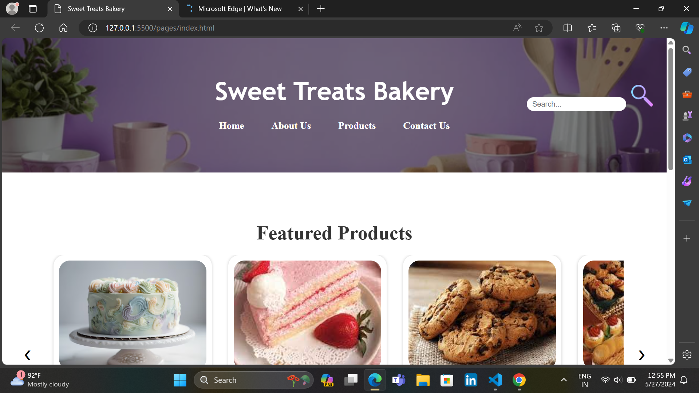

# Sweet Threats Bakery
 

.png)

Bakery is a mobile first, clean and responsive template built for a bakery.

Built using HTML, CSS and Javascript.

All the images were gotten from Unsplash and Pexels.

The project contains Four pages which are:

1. The Homepage - This pages Contains some feature of Bakery

2. About Page - This contains few details about the bakery.

3. Contact Page - This page contains contact information.

4. Product Page - This contain the different product of Bakery 

Live Url = https://github.com/Harshda25/Sweet-Treats-Bakery

[def]: <Screenshot.png>